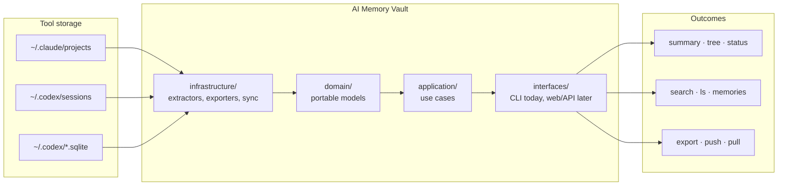

# AI Memory Vault

[](LICENSE)
[](https://www.python.org/downloads/)
[](https://github.com/sbsepul/ai-memory-vault)

<table>
<tr>
<td align="center" width="140">
<a href="https://github.com/anthropics/claude-code"></a><br/>
<b><a href="https://github.com/anthropics/claude-code">Claude Code</a></b><br/>
<sub>Anthropic</sub>
</td>
<td align="center" width="140">
<a href="https://github.com/openai/codex"></a><br/>
<b><a href="https://github.com/openai/codex">Codex CLI</a></b><br/>
<sub>OpenAI</sub>
</td>
<td align="center" width="140">
<a href="https://github.com/anomalyco/opencode"></a><br/>
<b><a href="https://github.com/anomalyco/opencode">opencode</a></b><br/>
<sub>Anomaly / SST ecosystem</sub>
</td>
<td align="center" width="140">
<a href="https://github.com/google-antigravity/antigravity-cli"></a><br/>
<b><a href="https://github.com/google-antigravity/antigravity-cli">Antigravity CLI</a></b><br/>
<sub>Google</sub>
</td>
<td align="center" width="140">
<a href="https://github.com/github/copilot-cli"></a><br/>
<b><a href="https://github.com/github/copilot-cli">Copilot CLI</a></b><br/>
<sub>GitHub</sub>
</td>
</tr>
</table>

**AI Memory Vault is your personal database of AI coding history.**

It extracts sessions from local coding agents, normalizes them into a portable model, and lets you search, export, back up, and restore that history without depending on one specific terminal UI.

```bash
vault summary
vault tree
vault search "auth flow"
vault push
```

## Why it exists

AI coding sessions contain architectural decisions, debugging context, tradeoffs, and implementation history that usually disappear when you change machines or tools.

AI Memory Vault focuses on three jobs:

| Goal | What it gives you |
|---|---|
| Discover | What session history you have, where it came from, and which repos it belongs to |
| Preserve | Private git-based backup and cross-machine restore |
| Recall | Full-text search, Markdown export, and access to hidden Codex memory summaries |

## Supported projects

The repo already works with:

- [Claude Code](https://github.com/anthropics/claude-code)
- [Codex CLI](https://github.com/openai/codex)

The README also links the public repos for adjacent tools this architecture is intended to support next:

- [opencode](https://github.com/anomalyco/opencode)
- [Antigravity CLI](https://github.com/google-antigravity/antigravity-cli)
- [GitHub Copilot CLI](https://github.com/github/copilot-cli)

## How it works



All project paths are normalized relative to `$HOME`, so history can move between machines without hardcoding usernames into the stored metadata.

## How To Install

### Install with `uv`

```bash
uv tool install git+https://github.com/sbsepul/ai-memory-vault.git
```

### Install with `pip`

```bash
pip install git+https://github.com/sbsepul/ai-memory-vault.git
```

### Install from source

```bash
git clone https://github.com/sbsepul/ai-memory-vault.git
cd ai-memory-vault
uv sync
```

### Requirements

- Python 3.10+
- Claude Code and/or Codex already used at least once on the machine
- `git` installed
- `gh` installed only if you want `vault init --remote`

## Get Started

After installation, validate that the vault can see your local history:

```bash
vault summary
vault tree
vault status
```

Then export or back up your history:

```bash
vault export
vault push --vault-repo git@github.com:you/my-vault.git
```

## Commands

### Discover

```bash
vault summary
vault tree
vault status --resolve
```

### Recall

```bash
vault ls --project backend
vault search "migration"
vault memories --project my-project
```

### Preserve

```bash
vault export --format markdown
vault push --include-raw
vault pull --restore-claude
```

## Architecture

The project was restructured so the codebase can grow beyond a single CLI module:

```text
src/ai_memory_vault/
├── domain/          # core models and report objects
├── application/     # orchestration and use-case services
├── infrastructure/  # extractors, exporters, sync adapters
├── interfaces/      # CLI today, future web/API entrypoints
├── extractors/      # compatibility wrappers over infrastructure/
├── exporters/       # compatibility wrappers over infrastructure/
├── sync/            # compatibility wrappers over infrastructure/
└── cli.py           # thin entrypoint only
```

That split keeps parsing, persistence, transport, and UI concerns separate. A future web app should be able to reuse `domain/` and `application/` directly instead of importing click commands or terminal rendering code.

## Development

Install dev tooling:

```bash
uv sync --extra dev
pre-commit install
```

Run formatters and checks:

```bash
uv run ruff check . --fix
uv run ruff format .
uv run isort .
uv run python -m compileall src
```

## Contributing

See [CONTRIBUTING.md](CONTRIBUTING.md) for contributor setup, project structure, and extension guidance.

## License

MIT
