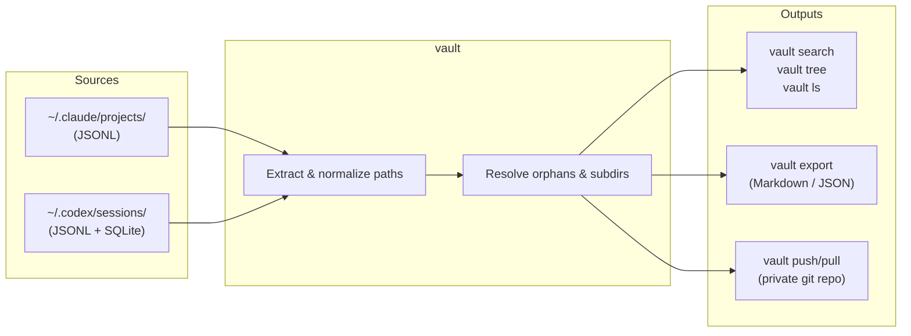

# ai-memory-vault

[](LICENSE)
[](https://www.python.org/downloads/)
[](https://claude.ai/code)
[](https://github.com/openai/codex)

**Your AI coding sessions disappear when you switch machines. `ai-memory-vault` fixes that.**

It reads every conversation from **Claude Code CLI** and **Codex CLI**, normalizes paths so they survive machine migrations, and gives you a single command to search, export, and sync your entire AI history — privately.

```bash
vault summary        # how much history do I have?
vault search "auth"  # find any conversation, instantly
vault push           # back up everything to a private git repo
```

---

## How it works



All paths are stored **relative to `$HOME`** — so `repos/my-project` works on any machine regardless of username or OS.

---

## Get Started

**With [uv](https://docs.astral.sh/uv/) (recommended):**

```bash
uv tool install git+https://github.com/sbsepul/ai-memory-vault.git
vault summary
```

**With pip:**

```bash
pip install git+https://github.com/sbsepul/ai-memory-vault.git
vault summary
```

**From source:**

```bash
git clone https://github.com/sbsepul/ai-memory-vault.git
cd ai-memory-vault
uv sync && vault summary
# or: python3 -m venv .venv && source .venv/bin/activate && pip install -e .
```

> **Requirements:** Python 3.10+. Claude Code CLI and/or Codex CLI must be installed and have been used at least once.

---

## Commands

### `vault summary` — how much history do you have?

```bash
vault summary
vault summary --source claude
```

| Source | Sessions | Messages | Projects |
|--------|----------|----------|----------|
| Claude Code | 120 | 18,340 | 22 |
| Codex | 430 | 31,200 | 48 |
| **Total** | **550** | **49,540** | **58** |

---

### `vault tree` — which projects have AI history?

```bash
vault tree
vault tree --source codex
```

| Project (rel. to ~) | Git | Claude | Codex | Msgs |
|---|:---:|---|---|---:|
| repos/web-app | ✅ | 14s / 3100m | 8s / 1200m | 4,300 |
| repos/api-service | ✅ | 6s / 980m | 22s / 4100m | 5,080 |
| Downloads/scratch-notes | 📂 | — | 3s / 41m | 41 |
| repos/old-prototype | ❌ | 2s / 88m | — | 88 |

**Git column legend:**

| Icon | Meaning |
|------|---------|
| ✅ | Git repo — history is recoverable from version control |
| 📂 | Directory exists but has no git repo — most important to back up |
| 🗂️ | Parent directory — contains sub-repos, history shown for context |
| ❌ | Directory no longer exists on disk — history is orphaned |

---

### `vault status` — cross-reference repos vs AI history

```bash
vault status
vault status --resolve   # auto-detect orphan → canonical path mappings
```

`--resolve` uses git remote URLs and normalized name matching to detect when a project was renamed or moved, and saves the mapping so all future commands apply it automatically.

---

### `vault init` — create a git repo for a no-git directory

When `vault status` shows a `📂` path (has AI history, no git):

```bash
vault init --project "Downloads/notes"           # git init + gh repo create (private)
vault init --project work/my-folder --public     # public GitHub repo
vault init --project work/my-folder --no-remote  # local only
```

---

### `vault ls` — list sessions for a project

```bash
vault ls --project my-project
vault ls --project backend --source codex --limit 20
```

---

### `vault search` — full-text search across all sessions

```bash
vault search "authentication middleware"
vault search "docker compose" --source codex
vault search "migration" --project backend --limit 5
```

Returns matches with surrounding context, timestamps, and project path.

---

### `vault export` — export to Markdown or JSON

```bash
vault export                                    # everything → ~/ai-memory-vault-export/
vault export --source codex
vault export --project my-project
vault export --format json --output ./backup
vault export --since 2026-01-01
```

Output mirrors the source structure:

```
~/ai-memory-vault-export/
├── claude/
│   └── repos/my-project/
│       ├── 20260115-1430_37825382.md
│       └── 20260203-0912_54da0e24.md
└── codex/
    └── work/backend/
        └── 20260601-1219_019e83fc.md
```

---

### `vault push` — back up to a private git repo

```bash
# First run — save vault URL for future use
vault push --vault-repo git@github.com:you/my-vault.git

# Every run after
vault push

# Include raw Claude JSONL for full native restore on a new machine
vault push --include-raw
```

---

### `vault pull` — restore on a new machine

```bash
vault pull --vault-repo git@github.com:you/my-vault.git   # Markdown exports
vault pull --restore-claude                                  # restore Claude sessions natively
vault pull --restore-claude --dry-run                       # preview without writing
```

Path re-encoding is **automatic** — a session from `/home/alice/repos/project` is restored to the correct path for the current user on the new machine, no manual editing needed.

---

### `vault memories` — read Codex auto-generated memory summaries

Codex silently generates condensed session summaries in `~/.codex/memories_1.sqlite` after each conversation. They are not visible anywhere in the Codex UI. `vault memories` is the only way to read them.

```bash
vault memories
vault memories --project my-project
vault memories --output memories.md
vault memories --limit 10
```

---

## Cross-machine migration

```
# ── Machine A (source) ───────────────────────────────
vault push --vault-repo git@github.com:you/vault.git --include-raw

# ── Machine B (destination) ──────────────────────────
uv tool install git+https://github.com/sbsepul/ai-memory-vault.git
vault pull --vault-repo git@github.com:you/vault.git --restore-claude

# Restart Claude Code — sessions are immediately available
```

---

## Security

**What vault reads (locally, read-only):**

| Path | Contents | Used for |
|------|----------|----------|
| `~/.claude/projects/` | JSONL session files | Claude Code history |
| `~/.codex/sessions/` | JSONL session files | Codex history |
| `~/.codex/memories_1.sqlite` | Auto-generated summaries | `vault memories` |
| `~/.codex/state_5.sqlite` | Thread metadata (cwd, title) | Project path resolution |

**What vault never does:**
- Makes no network requests of its own
- Sends no telemetry or analytics
- Does not read `logs_2.sqlite` (243 MB Codex debug log — ignored)
- Does not write to `~/.claude/` or `~/.codex/` except during `vault pull --restore-claude`

**`vault push` / `vault pull`:** Your conversation history — including code, file contents, and prompts — is sent to the private git repository **you control**. Use a private repo. The transport is whatever your git remote uses (SSH or HTTPS).

**`vault export`** writes plaintext files to disk. Exports contain your full conversation history. Treat them accordingly.

---

## Storage formats

### Claude Code (`~/.claude/projects/`)

Directory names encode the absolute project path by replacing `/` with `-` (e.g. `-home-user-repos-my-project`). `vault` decodes this by reading the `cwd` field from JSONL events rather than the directory name — this avoids ambiguity when project names contain hyphens.

### Codex CLI (`~/.codex/`)

Sessions are stored as JSONL files under `sessions/YYYY/MM/DD/`. Messages are wrapped in `event_msg` envelopes with a `payload.type` discriminator (`user_message`, `agent_message`, `task_complete`). The project path comes from the `session_meta` event's `cwd` field.

Codex also maintains four SQLite databases:

| File | Contents | Used by vault |
|------|----------|:---:|
| `memories_1.sqlite` | Auto-generated memory summaries | ✅ |
| `state_5.sqlite` | Thread index: `cwd`, title, first message | ✅ |
| `logs_2.sqlite` | Internal debug logs (~243 MB) | ❌ |
| `goals_1.sqlite` | Goal tracking (empty in most installs) | ❌ |

---

## Roadmap

- [x] Dual-source extraction (Claude Code + Codex)
- [x] Portable paths — relative to `$HOME`, survives username changes
- [x] `vault push` / `vault pull` — private git backup and cross-machine restore
- [x] `vault memories` — surface Codex SQLite summaries
- [x] `vault status` — cross-reference repos on disk vs AI history
- [x] `vault status --resolve` — auto-detect orphan path mappings
- [x] `vault init` — create a git repo for no-git directories with AI history
- [ ] `vault pull --restore-codex` — restore Codex sessions (SQLite rebuild)
- [ ] `vault serve` — local web viewer for browsing conversations
- [ ] Incremental export (only new sessions since last run)
- [ ] Cursor and Windsurf support

---

## Contributing

Issues and PRs welcome. Please open an issue before working on a large change.

## License

MIT
