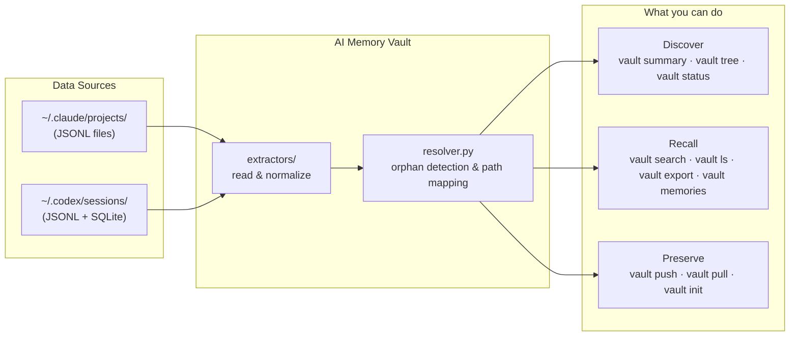

# AI Memory Vault

[](LICENSE)
[](https://www.python.org/downloads/)
[](https://github.com/sbsepul/ai-memory-vault)

<table>
<tr>
<td align="center" width="160">
<br/>
<b>Claude Code</b><br/>
<sub>by Anthropic</sub>
</td>
<td align="center" width="160">
<br/>
<b>Codex CLI</b><br/>
<sub>by OpenAI</sub>
</td>
<td align="center" width="160">
<br/>
<b>Cursor</b><br/>
<sub>coming soon</sub>
</td>
<td align="center" width="160">
<br/>
<b>Windsurf</b><br/>
<sub>coming soon</sub>
</td>
</tr>
</table>

**AI Memory Vault is your personal database of AI history — the place where everything you've built with AI coding assistants lives.**

Every session you've had with Claude Code or Codex CLI is a piece of institutional memory. Those sessions contain the reasoning behind architecture decisions, the context that led to a refactor, the debugging process that caught a subtle bug. When you switch machines, when a tool updates its storage format, when a directory gets deleted — that memory disappears.

AI Memory Vault gives it a home.

```bash
vault summary        # what history do I have?
vault tree           # which projects have AI sessions?
vault search "auth"  # find any conversation, instantly
vault push           # back up everything to a private git repo
```

---

## What is this?

Most developers don't realize how much institutional knowledge is locked inside their AI coding sessions. The conversation where you designed the auth flow. The session where you debugged that race condition at 2am. The prompt chain that produced your best data pipeline.

**When you lose those sessions, you lose the reasoning behind your decisions.**

AI Memory Vault solves three problems:

| | |
|---|---|
| **Discover** | What history do you actually have? How many sessions, across which projects, going back how far? |
| **Preserve** | Back up everything to a private git repo. Migrate seamlessly between machines without losing a single conversation. |
| **Recall** | Full-text search across all sessions. Export to Markdown. Browse by project. Surface Codex memory summaries you never knew existed. |

---

## How it works



All paths are stored **relative to `$HOME`** — so `repos/my-project` works on any machine regardless of username or OS. A session from `/home/alice/repos/project` is automatically re-encoded when restored on a machine where it lives at `/home/bob/repos/project`.

---

## Get Started

**With [uv](https://docs.astral.sh/uv/) (recommended):**

```bash
uv tool install git+https://github.com/sbsepul/ai-memory-vault.git
vault summary
```

**With pip:**

```bash
pip install git+https://github.com/sbsepul/ai-memory-vault.git
vault summary
```

**From source:**

```bash
git clone https://github.com/sbsepul/ai-memory-vault.git
cd ai-memory-vault
uv sync && vault summary
# or: python3 -m venv .venv && source .venv/bin/activate && pip install -e .
```

> **Requirements:** Python 3.10+. Claude Code CLI and/or Codex CLI must be installed and have been used at least once.

**Coming soon:** `vault setup` — a guided onboarding command that detects your installed AI tools, shows what history is available, and walks you through configuring a backup repo. See the [Roadmap](#roadmap).

---

## Commands

### Discover

#### `vault summary` — how much history do you have?

```bash
vault summary
vault summary --source claude
```

| Source | Sessions | Messages | Projects |
|--------|----------|----------|----------|
| Claude Code | 120 | 18,340 | 22 |
| Codex | 430 | 31,200 | 48 |
| **Total** | **550** | **49,540** | **58** |

---

#### `vault tree` — which projects have AI history?

```bash
vault tree
vault tree --source codex
```

| Project (rel. to ~) | Git | Claude | Codex | Msgs |
|---|:---:|---|---|---:|
| repos/web-app | ✅ | 14s / 3100m | 8s / 1200m | 4,300 |
| repos/api-service | ✅ | 6s / 980m | 22s / 4100m | 5,080 |
| Downloads/scratch-notes | 📂 | — | 3s / 41m | 41 |
| repos/old-prototype | ❌ | 2s / 88m | — | 88 |

**Git column legend:**

| Icon | Meaning |
|------|---------|
| ✅ | Git repo — history is recoverable from version control |
| 📂 | Directory exists but has no git repo — most important to back up |
| 🗂️ | Parent directory — contains sub-repos, history shown for context |
| ❌ | Directory no longer exists on disk — history is orphaned |

---

#### `vault status` — cross-reference repos vs AI history

```bash
vault status
vault status --resolve   # auto-detect orphan → canonical path mappings
```

`--resolve` uses git remote URLs and normalized name matching to detect when a project was renamed or moved, and saves the mapping so all future commands apply it automatically.

---

### Preserve

#### `vault init` — create a git repo for a no-git directory

When `vault status` shows a `📂` path (has AI history, no git):

```bash
vault init --project "Downloads/notes"           # git init + gh repo create (private)
vault init --project work/my-folder --public     # public GitHub repo
vault init --project work/my-folder --no-remote  # local only
```

---

#### `vault push` — back up to a private git repo

```bash
# First run — save vault URL for future use
vault push --vault-repo git@github.com:you/my-vault.git

# Every run after
vault push

# Include raw Claude JSONL for full native restore on a new machine
vault push --include-raw
```

---

#### `vault pull` — restore on a new machine

```bash
vault pull --vault-repo git@github.com:you/my-vault.git   # Markdown exports
vault pull --restore-claude                                  # restore Claude sessions natively
vault pull --restore-claude --dry-run                       # preview without writing
```

Path re-encoding is **automatic** — a session from `/home/alice/repos/project` is restored to the correct path for the current user on the new machine, no manual editing needed.

---

### Recall

#### `vault ls` — list sessions for a project

```bash
vault ls --project my-project
vault ls --project backend --source codex --limit 20
```

---

#### `vault search` — full-text search across all sessions

```bash
vault search "authentication middleware"
vault search "docker compose" --source codex
vault search "migration" --project backend --limit 5
```

Returns matches with surrounding context, timestamps, and project path.

---

#### `vault export` — export to Markdown or JSON

```bash
vault export                                    # everything → ~/ai-memory-vault-export/
vault export --source codex
vault export --project my-project
vault export --format json --output ./backup
vault export --since 2026-01-01
```

Output mirrors the source structure:

```
~/ai-memory-vault-export/
├── claude/
│   └── repos/my-project/
│       ├── 20260115-1430_37825382.md
│       └── 20260203-0912_54da0e24.md
└── codex/
    └── work/backend/
        └── 20260601-1219_019e83fc.md
```

---

#### `vault memories` — read Codex auto-generated memory summaries

Codex silently generates condensed session summaries in `~/.codex/memories_1.sqlite` after each conversation. They are not visible anywhere in the Codex UI. `vault memories` is the only way to read them.

```bash
vault memories
vault memories --project my-project
vault memories --output memories.md
vault memories --limit 10
```

---

## Cross-machine migration

```bash
# ── Machine A (source) ───────────────────────────────
vault push --vault-repo git@github.com:you/vault.git --include-raw

# ── Machine B (destination) ──────────────────────────
uv tool install git+https://github.com/sbsepul/ai-memory-vault.git
vault pull --vault-repo git@github.com:you/vault.git --restore-claude

# Restart Claude Code — sessions are immediately available
```

---

## Security

**What vault reads (locally, read-only):**

| Path | Contents | Used for |
|------|----------|----------|
| `~/.claude/projects/` | JSONL session files | Claude Code history |
| `~/.codex/sessions/` | JSONL session files | Codex history |
| `~/.codex/memories_1.sqlite` | Auto-generated summaries | `vault memories` |
| `~/.codex/state_5.sqlite` | Thread metadata (cwd, title) | Project path resolution |

**What vault never does:**
- Makes no network requests of its own
- Sends no telemetry or analytics
- Does not read `logs_2.sqlite` (243 MB Codex debug log — ignored)
- Does not write to `~/.claude/` or `~/.codex/` except during `vault pull --restore-claude`

**`vault push` / `vault pull`:** Your conversation history — including code, file contents, and prompts — is sent to the private git repository **you control**. Use a private repo. The transport is whatever your git remote uses (SSH or HTTPS).

**`vault export`** writes plaintext files to disk. Exports contain your full conversation history. Treat them accordingly.

---

## Storage formats

### Claude Code (`~/.claude/projects/`)

Directory names encode the absolute project path by replacing `/` with `-` (e.g. `-home-user-repos-my-project`). `vault` decodes this by reading the `cwd` field from JSONL events rather than the directory name — this avoids ambiguity when project names contain hyphens.

### Codex CLI (`~/.codex/`)

Sessions are stored as JSONL files under `sessions/YYYY/MM/DD/`. Messages are wrapped in `event_msg` envelopes with a `payload.type` discriminator (`user_message`, `agent_message`, `task_complete`). The project path comes from the `session_meta` event's `cwd` field.

Codex also maintains four SQLite databases:

| File | Contents | Used by vault |
|------|----------|:---:|
| `memories_1.sqlite` | Auto-generated memory summaries | ✅ |
| `state_5.sqlite` | Thread index: `cwd`, title, first message | ✅ |
| `logs_2.sqlite` | Internal debug logs (~243 MB) | ❌ |
| `goals_1.sqlite` | Goal tracking (empty in most installs) | ❌ |

---

## Architecture

AI Memory Vault follows a simple pipeline: extract raw data from each AI tool, normalize it into a shared model, then let the CLI commands consume that model for search, export, and sync.

```
src/ai_memory_vault/
├── extractors/          # reads raw data from each AI tool
│   ├── models.py        # Session and Message dataclasses — the shared data contract
│   ├── claude.py        # reads ~/.claude/projects/ JSONL files
│   ├── codex.py         # reads ~/.codex/sessions/ JSONL files + session_index.jsonl
│   └── codex_memory.py  # reads ~/.codex/memories_1.sqlite
├── exporters/           # converts sessions to output formats
│   └── markdown.py      # writes Session objects to .md files
├── sync/                # git backup and restore logic
│   └── git.py           # vault push / vault pull implementation
├── resolver.py          # detects orphaned paths, maps old → new project locations
├── search.py            # full-text search across all sessions
├── status.py            # cross-references on-disk repos vs AI history
├── tree.py              # project-level aggregation and display
├── config.py            # all paths, defaults, and per-source metadata
├── utils.py             # shared helpers (path normalization, timestamp parsing)
└── cli.py               # Click command definitions — all vault subcommands
```

The central data contract is `extractors/models.py`. Every extractor produces `Session` objects with a `project_rel_path` relative to `$HOME`. Everything downstream — search, export, sync — works with those objects and never needs to know which AI tool they came from.

To add a new AI tool, you implement one function: `extract_all() -> list[Session]`. See [CONTRIBUTING.md](CONTRIBUTING.md) for a step-by-step guide.

---

## Roadmap

- [x] Dual-source extraction (Claude Code + Codex)
- [x] Portable paths — relative to `$HOME`, survives username changes
- [x] `vault push` / `vault pull` — private git backup and cross-machine restore
- [x] `vault memories` — surface Codex SQLite summaries
- [x] `vault status` — cross-reference repos on disk vs AI history
- [x] `vault status --resolve` — auto-detect orphan path mappings
- [x] `vault init` — create a git repo for no-git directories with AI history
- [ ] `vault setup` — guided onboarding: detect installed AI tools, show available history, configure backup repo
- [ ] `vault pull --restore-codex` — restore Codex sessions (SQLite rebuild)
- [ ] `vault serve` — local web UI for browsing and searching conversations
- [ ] `vault memories --claude` — Claude Code memory files support
- [ ] Incremental export (only new sessions since last run)
- [ ] Plugin system for Cursor, Windsurf, and Zed support

---

## Contributing

See [CONTRIBUTING.md](CONTRIBUTING.md) for a guide on project structure, how to add support for a new AI tool, running tests, and the pull request process.

Issues and PRs welcome. Please open an issue before working on a large change.

## License

MIT
